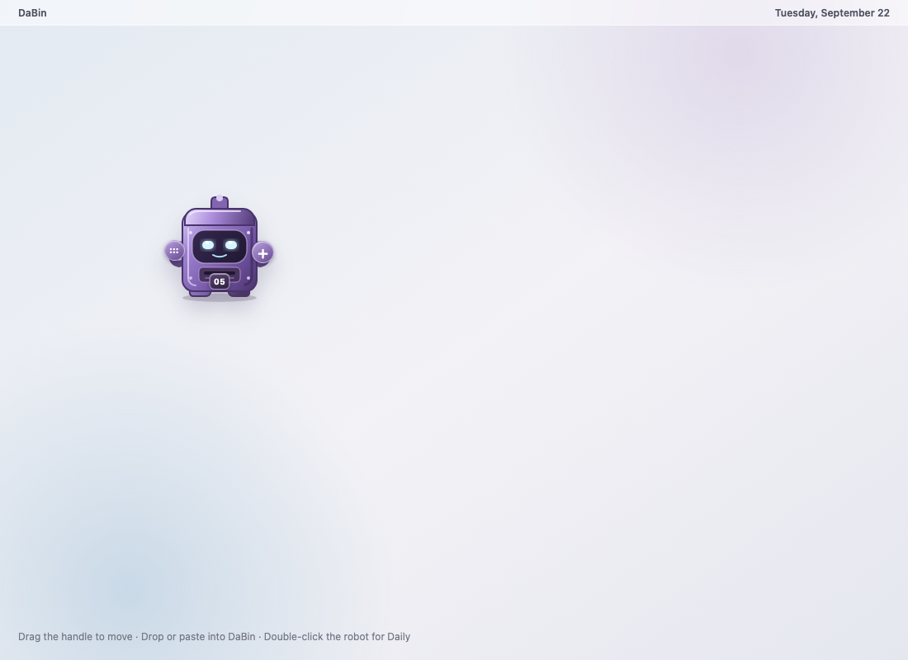

# DaBin

DaBin is a native Apple Silicon macOS app that turns things you paste or drag into a private daily board. By default, moving the pointer into any screen corner reveals a small purple robot. On a Mac with a built-in camera island, Settings can move its home below the island; displays without one continue using their corners. Drop text, links, images, videos, PDFs, documents, or several files onto the robot, or hover and paste; double-click it to browse Daily.

Captures stay on the Mac in a dated archive. Each card can hold a comment or reminder. Tasks carry forward until completed, unless they have a reminder date. Daily includes type filters and contextual search; a compact Daily/Weekly control opens seven days ending on the selected date and returns without losing the selected date, filter, scroll position or drafts. The board supports dark mode, theme colors and adjustable transparency. The native robot looks toward the pointer, opens up for incoming content, chews while saving and responds to the result. It follows the macOS Reduce Motion preference.



## Start here

- [Native app guide](native/README.md)
- [0.3.4 release notes](docs/RELEASE_NOTES_0.3.4.md)
- [One-page PDF guide](docs/DaBin-Quick-Guide.pdf)
- [Architecture](native/ARCHITECTURE.md)
- [QA results](native/QA_RESULTS.md)
- [Privacy policy](native/Resources/PrivacyPolicy.md)
- [Mac App Store readiness](native/APP_STORE_READINESS.md)
- [Documentation index](docs/README.md)

## Build

DaBin targets Apple Silicon and macOS 14 or later. The local build uses Apple Command Line Tools:

```sh
cd native
./scripts/build.sh
./scripts/test.sh
```

The optimized app is written to `native/build/DaBin.app`. Full GUI QA needs an unlocked macOS session. The checked-in Xcode project provides the App Store build path when full Xcode and an Apple Developer team are available.

## Updates

The direct build has a user-initiated GitHub Releases channel under **Settings → Software updates**. It accepts only this repository’s fixed HTTPS release path, verifies the published byte count and SHA-256 checksum, then gives the bundled installer a private, one-use update document. The installer validates and consumes that document, re-verifies the package and application, asks before replacement, and backs up the previous installation. The capture archive remains untouched. There are no silent update checks.

Release 0.3.4 supersedes 0.3.3, whose sandboxed updater launch could lose its package arguments before the installer opened.

The current personal release is ad-hoc signed for the owner’s Mac. General distribution still requires a stable Developer ID signature and Apple notarization. The Mac App Store configuration compiles without the direct downloader and helper; Store builds update through Apple.

## Repository scope

This repository contains the native source, resources, tests, build and release tools, design history, handoff documents, QA documentation, and the PDF guide. Generated builds, old ZIP packages, temporary renders, user data, and compiler caches are ignored. Release ZIPs belong in GitHub Releases.

No open source license has been granted in this repository.
