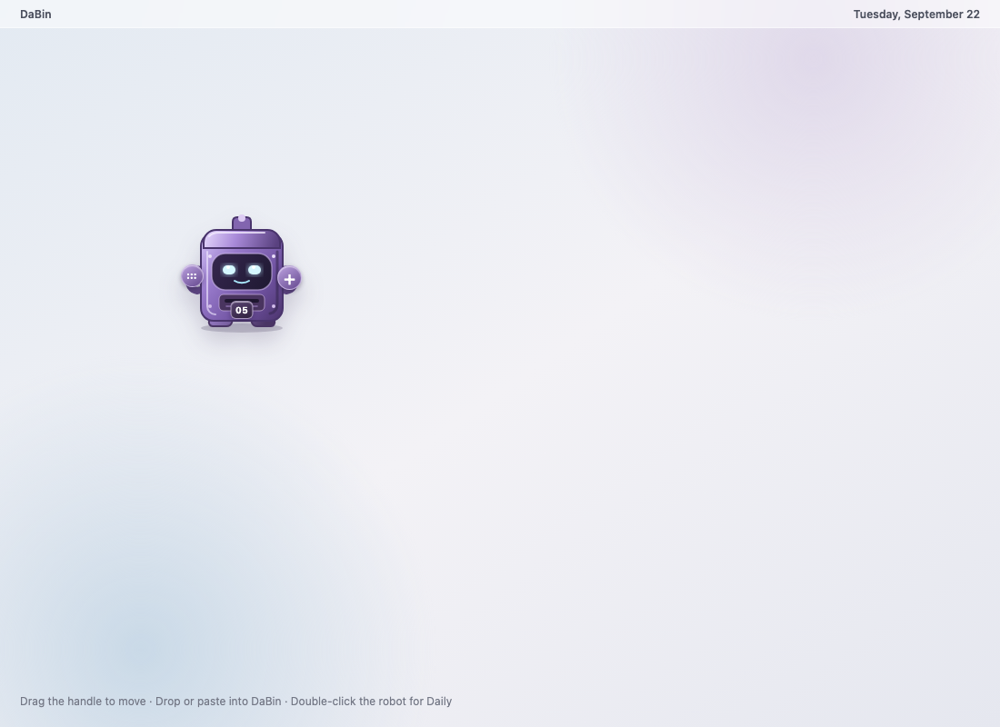

# DaBin

DaBin is a little robot for the useful bits of your day. It keeps your ideas, links, images and files together on your Mac. Drop something onto the robot, keep it with a project, and find it again when you need it. It runs natively on Apple Silicon Macs.

Three labeled views organize the work: **Inbox** for quick captures and the **Day / Week** calendar, **Today** for deliberate workday planning, and **Projects** for project resources, clipboard history, named snippets, a collection shelf and autosaving notes. Within Inbox, **To organize** keeps unfiled items from all dates, **Day** shows the selected date, and **Week** opens the seven-day capture history. Empty dates stay hidden in Week. Organization is optional.

Tasks keep their original content and attachments. A planned workday is separate from a deadline or reminder. Choose a priority, estimate effort, reorder today’s plan, add checklist steps, set a repeat rule, complete work or reschedule it. Project scratchpads and unfinished composer/detail drafts recover locally after restart.

The **Search** toolbar icon opens a focused search field. In Weekly view it first offers **Search Day**, **Search Week**, or **Search All Captures**; **⌘K** always searches the full archive. The compact header keeps its tools and navigation in two rows. Results show matches first; **Show nearby captures** adds optional same-day context. Icon filters narrow by content type; their hover labels can be disabled in Settings. Under Inbox, the labeled **Day / Week** toggle and calendar preserve date browsing, selected filters and unfinished drafts. **Add** offers Paste clipboard, New note, Import files and New task. Preview-first cards expose copy, comment, reminder, task and more actions as icons. The gear opens Settings directly. **More** holds day/week text exports, Recently Deleted and archive backup/restore.

Removed captures go to **Recently Deleted**, with Undo for the latest removal and a separate confirmation for permanent deletion. A local `.dabinbackup` directory package includes capture metadata, saved originals, readable records, saved local edits and deleted captures. Restore verifies the package and adds missing captures; it rejects conflicts instead of overwriting existing data. Workspace notes, shelf references and snippet names are included. Device preferences and unfinished drafts are kept separately on this Mac.

Inbox opens once on first launch; reopening resumes the current work. Afterwards, use the robot, menu bar or global shortcuts: **⌃⌥Space** searches and **⌃⌥V** saves the current clipboard. Settings offers an alternate chord and lets you disable global shortcuts. **Quiet mode** opens the board promptly and suppresses automatic capture celebrations. The board supports dark mode and theme colors; new preferences default to an opaque background, while existing transparency choices are retained. The robot still follows macOS Reduce Motion.

DaBin recognizes text in saved screenshots, images, PDFs and supported text documents entirely on the Mac. Search can find that content even when the filename or caption does not contain the query, and shows the matching recognized line. Capture details expose the searchable text and Settings can rebuild the local index. This is local text search, not semantic search. There is no cloud sync, and no recognized content is sent to an external AI or OCR service.

The working version is **0.4.19, build 74**. The compact and expanded window now share smooth continuous corners, with easier-to-grab visible edges and physical outer corners that preserve header controls. The thin metallic rim uses vectors instead of a full-surface gradient/mask. It retains two-second brief messages, preview-led cards, the task timer alarm robot, coordinated closing, configurable tooltips, larger timestamps and click-to-open file previews. Projects retain selectable colors, leading labels and matching card frames; Auto Capture saves to the selected project and waves its project-name sign. See the [window chrome notes](docs/RELEASE_NOTES_0.4.19.md).

This candidate is installed and running with verified signatures and executable hashes matching the frozen build. All 18 selected Release suites pass across two frozen-input reports: 17 valid passing suites from the batch and the final focused closing suite's 400 checks. Native chrome QA covers all eight resize handles in compact and expanded windows, plus light/dark corners at 1× and 2×. Earlier CPU recording failures and the corrected sampler are documented; these previews are not live FPS measurements. Settings confirms 0.4.19 (74); tooltips remain enabled, Auto Capture remains paused and compact Explorer is restored after Expand/Restore. DaBin quit normally, with the previous 0.4.18 app backed up. The installer did not modify the archive. [Local installation verification and scope](docs/qa/local-install-0.4.19-2026-10-02/verification.json).

Unsaved-form errors, recovery controls, Undo and the click-to-dismiss task alarm remain available. The timeout governs brief DaBin UI messages, not macOS system notifications.

The **2 October App Store preparation** adds source privacy/tooling changes without replacing that installed app. All 73 final registered Release suites pass on the preparation sources; Store signing, macOS 14 runtime QA and owner/Connect declarations remain separate gates. The installed-app receipt above predates these changes. [Current preparation status](native/APP_STORE_READINESS.md).

The **Quiet Orbit** robot uses sharp metallic vector artwork, seven positions around a detected camera island, quiet idle behavior and small success/count feedback. Hover or drop still works directly on the robot. [Native UX/UI verification](docs/qa/quiet-orbit-2026-10-01/README.md).

## A little desktop buddy

Captures have larger fitted previews and a compact action rail. Turning a capture into a task transforms its card in place. Open its details to edit its title, attach more files or text, add a checklist and set reminders. A separate focus timer supports duration, pause, resume and reset; expiry leaves the task incomplete and shows the alarm robot until clicked. The alarm takes priority over Auto Capture feedback, without interrupting navigation or drafts. Work scheduling has an optional local time and stays separate from deadlines and notification reminders. A successful completion makes the visible robot happy. Countdown time starts when you save; it does not restart when reopened.

Explorer uses icon filters, preview-led visual cards, compact text rows and an expanded preview pane. Source badges use locally installed app icons when the saved source is available; website locations have a domain/globe fallback. DaBin shows its own verified storage destination. The source trail shows existing paste receipts without a manual-add button. Legacy manual events remain labeled “Recorded by you” and can still be removed to correct an old entry. Copying an item or switching applications never invents a paste event. App logos are loaded from local installed applications.

Auto Capture is beside the logo. The robot's full-view shell has a thin, continuous rounded rim; drag a visible edge or an outer corner to resize it, including inward from an expanded safe-area window. The grips stay within chrome and shallow padding so header buttons remain clickable. Expand/Restore fills the current display's safe area and returns to the prior window. Quiet Orbit manual reveal takes about half a second. Native window appearance follows the light/dark preference, and hover tooltips can be turned off without removing accessibility labels.

## Optional Auto Capture

Automatic **Clipboard** and **Screenshots** capture are separate opt-in choices, both **off by default**. Clipboard capture works without a screenshot folder. Screenshot capture requires a folder you explicitly choose; missing screenshot access does not stop an enabled clipboard channel. Enabling a channel establishes a new baseline: existing clipboard content and existing folder images are not imported. The board and Settings show the current state, and **Pause/Resume** controls the selected channels together.

Screenshot-folder access begins only after you choose a folder in the macOS folder picker. DaBin retains that authorization as a security-scoped bookmark so it can monitor the chosen location while Auto Capture is enabled. New image files in that folder are treated as screenshot captures, so choose a dedicated screenshot folder. macOS does not provide a public notification for every system screenshot: DaBin can see images written to the chosen folder, while screenshots sent to the clipboard can arrive through clipboard monitoring. A screenshot saved somewhere else is outside the folder monitor.

DaBin records a best-effort source application when macOS makes one reasonably identifiable. Source attribution can be unavailable or imprecise, so it is descriptive rather than proof of origin. DaBin itself and common password managers are excluded by default. If the same image arrives through the screenshot folder and clipboard within a short interval, a normalized fingerprint suppresses the second channel's copy; repeating the image later or through the same channel remains a new action. Four or more successful automatic actions in one capture hour become an expandable hourly group on Daily. A brief nonactivating robot emerges from the primary display's camera island, or the external primary display's top-right, and climbs down and eats a generic paper token using ten shuffled eating reactions, with no repeats from the previous three. Rapid captures share the token's exact `×N` count; later arrivals roll into one bounded follow-up group. Opening the board takes priority, and capture feedback waits until the board closes.

Automatic captures use the same local archive as manual captures. An automatically captured link never requests a website preview, even if previews are enabled for manually saved links. When Quiet mode is off, the confirmation begins only after an item has saved. Its native panel requests exclusion from window capture and never contains the captured image or clipboard text. macOS does not provide a universal pre-screenshot notification: third-party or system screen recorders can still include visible overlays depending on their capture API.

Double-clicking the robot transforms its body into the existing DaBin view in about 1.15 seconds. The native robot frame reserves space outside cards and controls; Quiet Orbit keeps decorative movement small. The eyes follow the pointer gently while the view is visible. Closing uses a coordinated 0.78-second fold into a compact robot, followed by a shrinking tuck toward its home. Reduce Motion retains a 0.14-second fade and a static frame. These are native Core Animation layers; the app keeps its usual compact window, navigation, drag/drop and keyboard controls.



## Latest release files

**Download status:** no 0.4.19 (74) binary release has been published. The current public download is 0.3.18. The links below contain that older release; they must not be described as the latest local candidate or a notarized testing installer. Source and documentation publication is separate from downloadable releases and App Store submission. The [0.4.6 review record](docs/qa/release-review-2026-10-01/README.md) remains historical evidence rather than verification of this new build.

- [In-app update package for an existing DaBin installation](https://github.com/RoeyAsterix/DaBin/releases/latest/download/DaBin-Latest-Update.zip)
- [Unsigned Apple Silicon test package](https://github.com/RoeyAsterix/DaBin/releases/latest/download/DaBin-Latest-AppleSilicon.zip)
- [Latest release details](https://github.com/RoeyAsterix/DaBin/releases/latest)

These permanent links follow the newest public GitHub release. The current files are ad-hoc signed and are not notarized. A browser, messaging app, or AirDrop marks them as downloaded, so Gatekeeper blocks a normal first installation. Existing DaBin installations can update safely through **Settings → Get updates**. A public first-install package must be signed with a Developer ID and notarized before it is described as a direct installer.

## Start here

- [Current Mac App Store preparation and unresolved submission gates](native/APP_STORE_READINESS.md)
- [Full 73-suite Release regression evidence](docs/qa/app-store-2026-10-02/tests/README.md)
- [Native app guide](native/README.md)
- [0.4.19 Smooth window corners and resize grips](docs/RELEASE_NOTES_0.4.19.md)
- [0.4.17 Preview-led Explorer cards](docs/RELEASE_NOTES_0.4.17.md)
- [0.4.18 Two-second UI messages](docs/RELEASE_NOTES_0.4.18.md)
- [0.4.16 Task timer alarm robot](docs/RELEASE_NOTES_0.4.16.md)
- [0.4.15 Preview-led collection cards](docs/RELEASE_NOTES_0.4.15.md)
- [0.4.14 Robot closing candidate](docs/RELEASE_NOTES_0.4.14.md)
- [0.4.13 Capture-trail cleanup candidate](docs/RELEASE_NOTES_0.4.13.md)
- [0.4.8 Performance candidate](docs/RELEASE_NOTES_0.4.8.md)
- [0.4.9 Click-to-open candidate](docs/RELEASE_NOTES_0.4.9.md)
- [0.4.10 Capture timestamps candidate](docs/RELEASE_NOTES_0.4.10.md)
- [0.4.12 Restored tooltips candidate](docs/RELEASE_NOTES_0.4.12.md)
- [0.4.11 Consistent robot candidate](docs/RELEASE_NOTES_0.4.11.md)
- [0.4.7 Projects and Auto Capture candidate](docs/RELEASE_NOTES_0.4.7.md)
- [0.4.6 Reviewed testing candidate](docs/RELEASE_NOTES_0.4.6.md)
- [0.4.5 Window resizing and display movement](docs/RELEASE_NOTES_0.4.5.md)
- [0.4.4 Open Design implementation notes](docs/RELEASE_NOTES_0.4.4.md)
- [Open Design QA and screenshots](docs/qa/open-design-2026-09-30/README.md)
- [0.4.3 Explorer candidate notes](docs/RELEASE_NOTES_0.4.3.md)
- [Explorer Open Design handoff](design/explorer-handoff-2026-09-30/README.md)
- [0.4.2 connected-workflow candidate notes](docs/RELEASE_NOTES_0.4.2.md)
- [Product review, evidence and roadmap](docs/review-2026-09-30/README.md)
- [0.4.0 local candidate notes](docs/RELEASE_NOTES_0.4.0.md)
- [0.3.18 release notes](docs/RELEASE_NOTES_0.3.18.md)
- [0.3.17 release notes](docs/RELEASE_NOTES_0.3.17.md)
- [0.3.16 release notes](docs/RELEASE_NOTES_0.3.16.md)
- [0.3.15 release notes](docs/RELEASE_NOTES_0.3.15.md)
- [Robot-led quick guide (PDF)](docs/DaBin-Quick-Guide.pdf)
- [Friendly product and guide copy](docs/DaBin-Friendly-Copy.txt)
- [Architecture](native/ARCHITECTURE.md)
- [QA results](native/QA_RESULTS.md)
- [Privacy policy](native/Resources/PrivacyPolicy.md)
- [Mac App Store readiness](native/APP_STORE_READINESS.md)
- [App Store Connect draft](docs/app-store/APP_STORE_CONNECT_DRAFT.md)
- [Current App Store listing and screenshot preparation](docs/app-store/APP_STORE_CONNECT_DRAFT.md)
- [Documentation index](docs/README.md)

## Build

DaBin targets Apple Silicon and macOS 14 or later. The local build uses Apple Command Line Tools:

```sh
cd native
./scripts/build.sh
./scripts/test.sh
```

The optimized app is written to `native/build/DaBin.app`. Full GUI QA needs an unlocked macOS session. The checked-in Xcode project provides the App Store build path when full Xcode and an Apple Developer team are available.

## Updates

The direct build has a user-initiated GitHub Releases channel under **Settings → Get updates**. It accepts only this repository’s fixed HTTPS release path, verifies the published byte count and SHA-256 checksum, then gives the bundled installer a private, one-use update document. The installer validates and consumes that document, re-verifies the package and application, asks before replacement, and backs up the previous installation. The capture archive remains untouched. There are no silent update checks.

Release 0.3.18 places **Get updates** at the top of Settings, with the installed version, live status, update check, conditional installation, and latest GitHub release link visible without scrolling. The repository’s permanent installer and direct-download URLs follow the newest public release while the in-app updater retains its exact versioned package and checksum validation.

The current personal release is ad-hoc signed for the owner’s Mac. General distribution still requires a stable Developer ID signature and Apple notarization. The Mac App Store configuration compiles without the direct downloader and helper; Store builds update through Apple.

## Repository scope

This repository contains the native source, resources, tests, build and release tools, design history, handoff documents, QA documentation, and the PDF guide. Generated builds, old ZIP packages, temporary renders, user data, and compiler caches are ignored. Release ZIPs belong in GitHub Releases.

No open source license has been granted in this repository.
