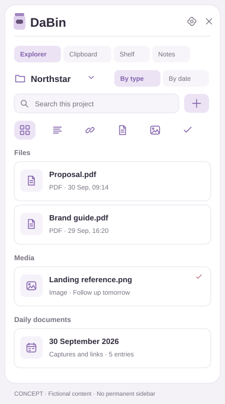
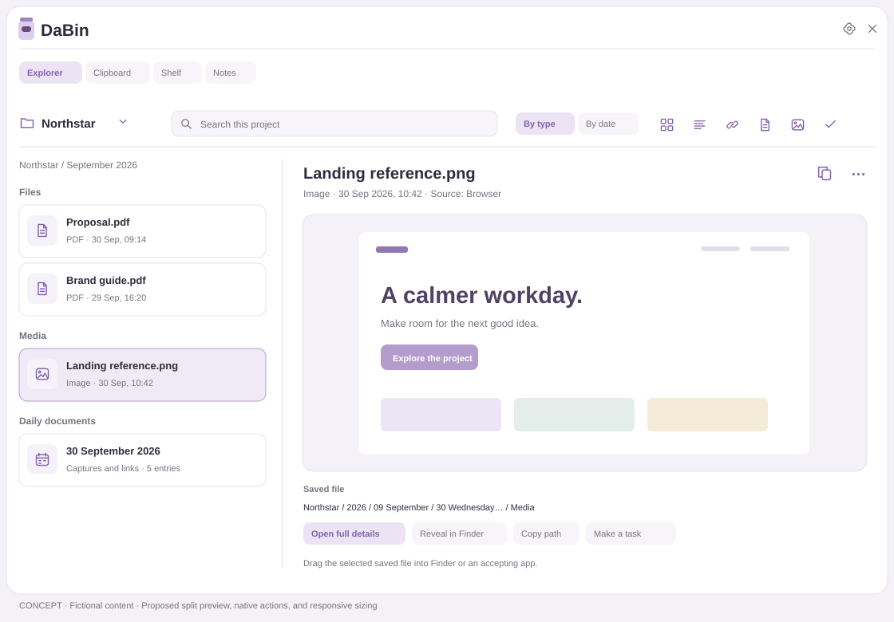

# DaBin Explorer handoff for Open Design

Start with `OPEN_DESIGN_PROMPT.txt`. This package explains the feature, keeps existing DaBin capabilities accounted for, and supplies compact and expanded wireframe concepts using fictional data.

| File | Purpose |
|---|---|
| BRIEF.md | Product decisions, storage semantics, layout, preservation, and requested design deliverables. |
| INTERACTIONS.md | Browse, select, capture, copy/drag, file under a project, task, daily document, keyboard, and recovery behavior. |
| ACCEPTANCE.md | Scenarios and responsive checks for design and later native verification. |
| IMPLEMENTATION_STATUS.md | Actual implementation evidence and gaps; authoritative distinction from proposed visuals. |
| SOURCE_MAP.md | Current native source ownership, actual Daily files toggle, transfer semantics, and deferred controls. |
| NATIVE_BUILD_NOTES.md | Instructions and boundaries for building the included runtime source. |
| native/ | Current runtime Swift source, resources, direct-update helper, and standalone build scripts. |
| SOURCE_SNAPSHOT.json | Exact version and checksums of the working-tree source snapshot. |
| wireframes/compact.svg | Low-fidelity narrow Explorer concept. |
| wireframes/expanded.svg | Low-fidelity list and large preview concept. |
| reference/BASELINE_FEATURES.csv | Eighty existing feature rows to preserve, frozen from build 53. |
| reference/ | Final build-55 synthetic Explorer renders, native QA/build/install/performance evidence, and labeled prior Library/detail references. |
| REFERENCE_PROVENANCE.json | Source and SHA-256 of copied references. |

The design is for DaBin on Apple Silicon macOS, not a replacement web app. The ZIP includes current runtime source and local build support; it is not an installer. This feature handoff supplements the complete app redesign handoff in `design/open-design-handoff-2026-09-30/` in the source repository. If a proposed control differs from current code, keep the distinction explicit.

The native implementation uses a **Daily files** toggle; the concepts below show a proposed integrated daily-document section. These are design alternatives, not identical screenshots of the implementation. Physical file renaming and project deletion remain deferred. The wireframes focus on Workspace content and abbreviate the surrounding app chrome; retain Inbox, Today, Auto Capture, and all existing window controls in the complete design.

## Compact concept

## Expanded concept

## Implemented compact Explorer

This is the actual SwiftUI/AppKit view rendered with isolated fictional fixtures at the minimum size. It is the implementation starting point for Open Design.

## Implemented expanded Explorer

## Implemented daily document preview

