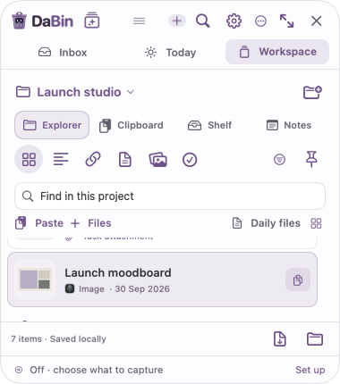
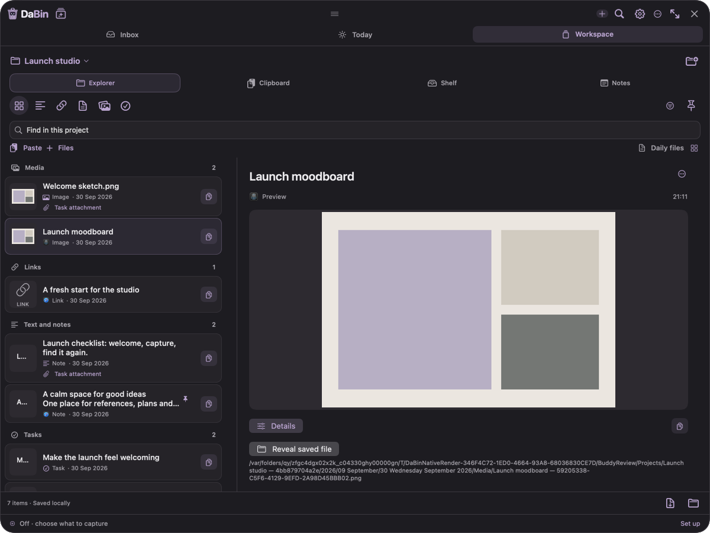
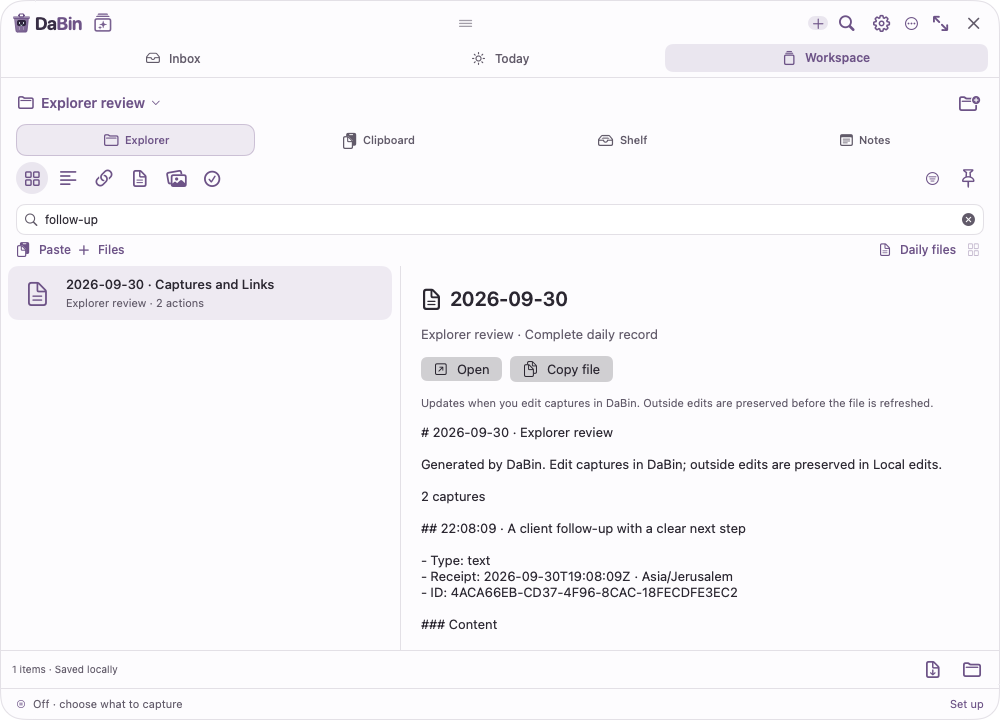

# Explorer implementation and QA — 30 September 2026

DaBin **0.4.3 (55)** is built and installed locally. This is a development build; no GitHub release, notarization or TestFlight upload was performed for this change.

## Implemented experience

Open **Workspace → Explorer**. Select a project or Unfiled, search within it, and group captures by type or date. Compact rows open capture details. At widths of 760 points and above, the selection previews alongside the list. Selection, project and query survive switching layouts.

Paste, file import and external drops use the current project. The All projects view sends new captures to Unfiled. Native outgoing drags supply files, URLs or text to compatible destinations. Copy uses content rather than an internal move marker. Dragging an existing capture onto a project moves it without importing a duplicate and offers Undo. Existing captures can be attached to a task through their contextual actions.

**Daily files** lists one dated Markdown document per project/day. Each document contains the complete day, regardless of the active filters, including text, links, comments, source information, task details, reminders and file references. Documents can be opened, copied, dragged, revealed or exported as a ZIP. Long in-app text previews are bounded; the actual exported file is complete.

Actual files are stored below Projects or Unfiled, then year, named month and named day, followed by Files or Media. Existing managed originals migrate using a durable journal, verified copy and committed metadata path before the former managed copy is removed. External source files remain untouched. Outside edits to generated daily documents are preserved in Local edits and backup recovery data.

## Verification

| Check | Result |
|---|---|
| Full optimized ARM64 suite | **53/53 passed**, final source unchanged during execution |
| New ProjectFileArchive tests | 56 checks |
| New ExplorerTransfer tests | 69 checks |
| New ExplorerQuery tests | 16 checks |
| Native WorkspaceWindow tests | 209 checks, including selection, search, Daily files and responsive routes |
| Production Explorer renders | 20; five sizes × light/dark × capture/daily-file modes |
| Release compilation | Passed, Swift warnings treated as errors |
| Generated Xcode project | Deterministic inventory check passed |
| Local installation | Guarded installer, previous app retained; strict deep signature verification passed |
| Installed binary | Version 0.4.3 (55), hash equals the final release binary |
| Existing data after migration | All 20 prior record IDs preserved; all eight managed attachment originals byte-identical |

The full-run receipt is [qa-full-53-suites.json](qa-full-53-suites.json), and the installed-data summary is [local-install-verification-build55.json](local-install-verification-build55.json). A hash-verified private backup of both existing local archive roots was made before first launch. Neither the backup nor user capture content is included here or in the design handoff. Additional captures arrived after launch; they were preserved and excluded from the original-record comparison.

Live native interaction confirmed Workspace opens the new Explorer with project selection, filters, capture rows, copy, paste, file intake, daily-file, ZIP and Finder controls. Auto Capture remained paused on first launch. A later live Daily files interaction lost the visible window; that route is verified by the isolated native interaction suite, not claimed as a completed personal-session check. App screenshots in this report use fictional test data and native production views.

## Bugs found and fixed during this cycle

- Explorer initially bypassed injected manual intake and could misreport busy state during late file promises. It now shares the established input service and tracks overlapping work independently.
- A corrupt foreign attachment path could prevent removal of its receipt. Removal now ignores unowned files while preserving their contents.
- Old layout assertions expected the retired managed Archive path; tests now check the new Unfiled layout while retaining content/byte checks.
- Long multibyte filenames could lose their extension when truncated. Filename components now respect a UTF-8 byte budget and preserve extensions and capture identity.
- Repeated chunk verification retained Foundation buffers and grew memory. A per-chunk autorelease pool reduced measured peak resident memory from about 1.07 GiB to 31 MiB in the isolated 64 MiB fixture.

## Performance scope

Three warm-cache trials imported a synthetic 64 MiB file in 39–65 ms, moved it between projects in 194–202 ms, and reopened its isolated store in 4.5–5.1 ms. The external source remained byte-identical. These are local storage measurements while other QA was running, not end-to-end app startup or broad hardware benchmarks. See [performance-64mib.json](performance-64mib.json) and the resource receipt.

## Visual evidence

## Remaining limitations

- Large existing-file relocations still verify synchronously and can briefly pause the interface. A background move queue is the next storage improvement.
- Third-party destination drag gestures, Finder edits during active replacement, physical display disconnection and VoiceOver were not exercised in the installed user session. Provider behavior, coordinated-file logic, focus/accessibility labels and display state are covered to varying degrees by the existing automated suites.
- Physical file/project renaming, project deletion, whole-folder import, multiple-row selection and ordinary task attachment unlinking remain deferred and are marked as such in the handoff.
- A daily document preview shows its first 64,000 bytes; copying, dragging and exporting supply the whole file.
- The compact minimum-height window requires scrolling. Open Design receives separate wireframe alternatives for a more compact future hierarchy; those concepts are not described as shipped native UI.

## Source areas

- `ProjectFileArchive.swift`, `CaptureStore.swift`, `CaptureRemoval.swift`, `ArchiveBackup.swift`, `OriginalFileStorage.swift`: managed layout, migration, documents and recovery.
- `ExplorerQuery.swift`, `ExplorerScreen.swift`, `ExplorerItems.swift`, `LibraryScreen.swift`, `WorkspaceStore.swift`: Explorer queries, selection, previews and persisted view context.
- `ExplorerTransfer.swift`, `AppState.swift`, `CornerController.swift`, `DailyCaptureView.swift`, `TaskAttachmentsView.swift`: native input, copy, drag and task attachment routing.
- New archive/query/transfer tests, extended workspace tests, render fixtures, runner registration, version metadata and generated project inventory.

The Open Design handoff at `design/explorer-handoff-2026-09-30/` separates implemented behavior, proposed design, deferred scope, feature-preservation requirements and source provenance.
