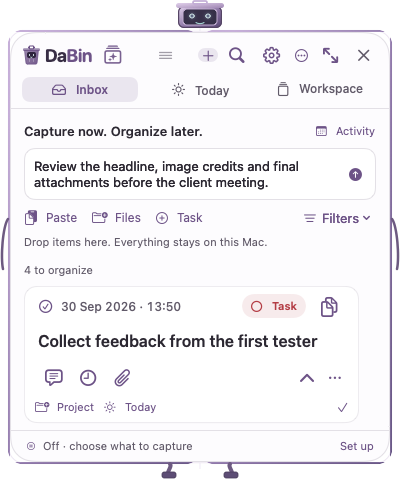
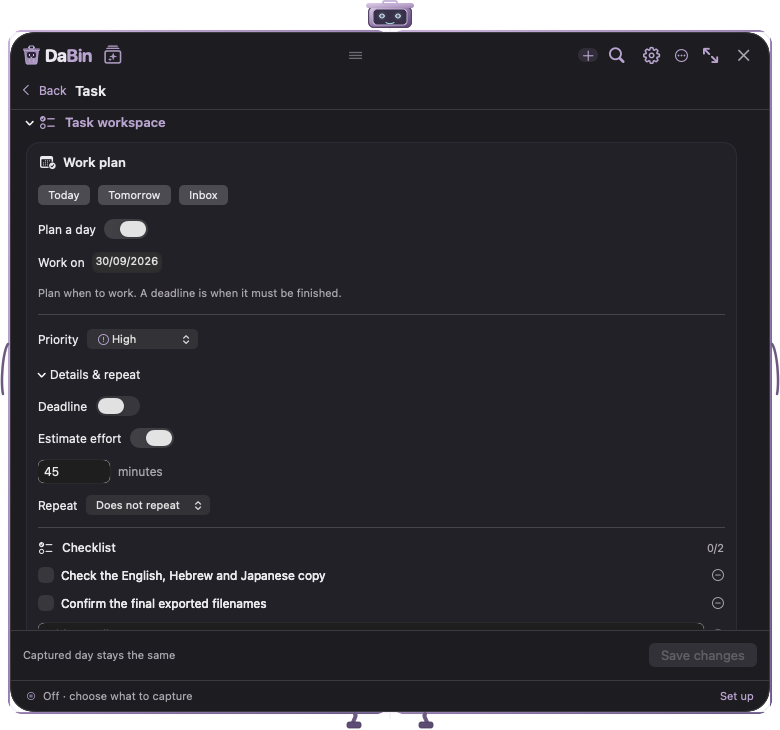
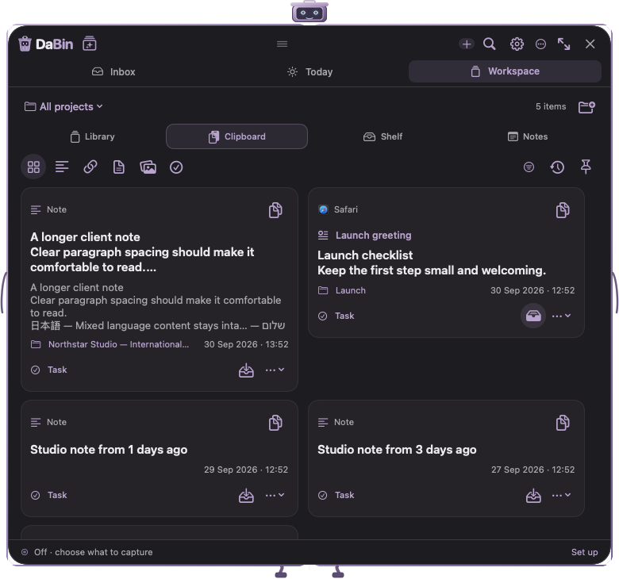

# Open Design handoff contents

Use [OPEN_DESIGN_PROMPT.txt](OPEN_DESIGN_PROMPT.txt) as the assignment and [BRIEF.md](BRIEF.md) as the authoritative redesign brief. This package describes the current native app and requires complete feature preservation.

| File | Purpose |
|---|---|
| [FEATURES.csv](FEATURES.csv) | 80 feature rows with owning source and blank new-location/evidence fields for the designer. |
| [SCREENS_AND_STATES.md](SCREENS_AND_STATES.md) | Required screens, responsive layouts, components, accessibility states, and robot motion. |
| [ACCEPTANCE.md](ACCEPTANCE.md) | 22 end-to-end scenarios, readability/keyboard checks, and later native engineering gates. |
| [SOURCE_MAP.md](SOURCE_MAP.md) | Architecture, keyboard behavior, implemented versus deferred features, and evidence limitations. |
| [SCREEN_PROVENANCE.json](SCREEN_PROVENANCE.json) | Version and SHA-256 for 25 synthetic reference screens. |
| assets/ | Original robot SVG and logo identity reference. Current vector/native implementation is in the source snapshot. |
| reference-screens/current-build53/ | Twenty current renders across ten surfaces, minimum light and expanded dark. |
| reference-screens/historical-build50/ | Five explicitly historical detail/timeline/robot-frame references. Their navigation is superseded. |

The package root includes `native/` source, tests, resources and build scripts frozen at the baseline commit; `MANIFEST.json` checksums the delivered contents. `build_package.py` is the repository-side packager and expects the original Git checkout and fixture sources; the handoff can be read without running it.

## Current compact Inbox

This is the current app’s production view rendered with fictional data, included as the starting point to improve. It is not a proposed redesign.

## Current expanded task detail

## Current expanded Clipboard

