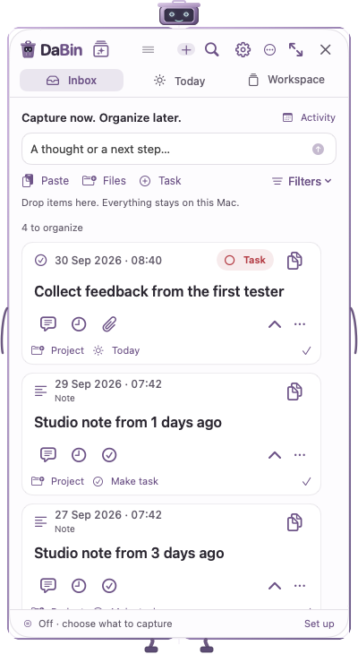
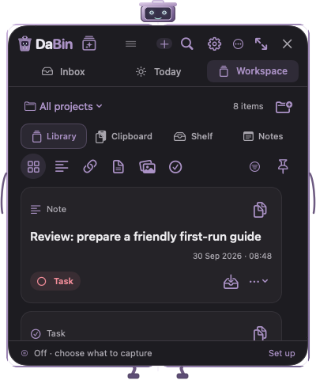
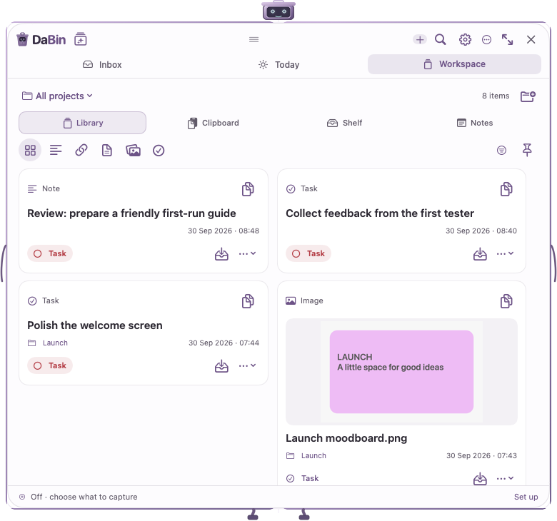

# Compact header — 30 September 2026

DaBin 0.4.2 (52), local Apple-silicon build.

## Change

The primary header now has two rows: logo and actions, then Inbox / Today / Workspace. Search stays visible as a toolbar icon and reveals a focused text field on click or Command-K. Detail/settings views show a compact Back/title row. Activity keeps its date and content filters. Header spacing is four points, vertical padding six points, and the drag grip remains available.

The compact native render saves about 55 vertical points (approximately 42% of the previous header). The search field requests focus after its native editor mounts. Existing navigation, filters and content are preserved.

## Visual evidence

The images use the existing isolated fictional-data fixture, never personal captures. Thirty-six renders cover both themes, 380×430 and 380×680 content sizes, and 760×680 expanded content. The production robot frame adds its existing 20×50 points around the content.

## Verification notes

The initial restricted build could not launch Xcode SwiftUI macro helpers; the native build succeeded with scoped local execution. Targeted native tests check compact geometry, icon targets, accessible menu actions, one-click search focus, keyboard shortcuts, Back navigation, filters, calendar, Settings, Expand and Hide. Native popup menus expose glyph bounds for accessibility and an inset backing control, so visual overlap assertions use the visible bounds.

Build and rendering provenance are stored alongside this report. Public release, notarization and TestFlight publication are separate from this local UI update.

## Final result

- Release build passes, 116 recorded build inputs match the installed executable; installed version is 0.4.2 (52).
- ProductFoundation: 49 checks; UpdateConfiguration: 27; WorkspaceWindow: 130; final HeaderInteraction: 159. These four relevant suites pass across the two recorded runs. The earlier header failures remain in the workflow report; the final header report supersedes that suite only. No full-suite rerun is claimed for this layout-only update.
- The standalone test process could not receive foreground keyboard focus on this Mac, so that one first-responder assertion is explicitly unverified there. The installed app was checked with native computer interaction instead: Search received focus immediately, typing updated its value, clearing worked, and Back restored Inbox. This completed the keyboard verification without changing system permissions.
- Thirty-six final native renders passed; the three representative after images are retained here. These use fictional content.
- Local installation preserved the previous application in its normal backup directory and left the archive intact. The final app was reopened to Inbox. Auto Capture remains paused.
- Deterministic project validation and git diff whitespace checks pass. This change has not been pushed or published.
