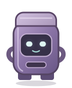
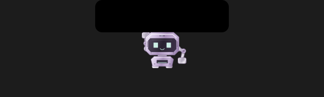

# Quiet Orbit UX/UI — 1 October 2026

Implemented and locally installed **DaBin 0.4.5 (60)**. The running Settings page confirms the version and “Around camera island” placement. The existing placement choice, capture formats, Inbox Day / Week, app-window behavior, hover ⌃V / ⌘V, native drops and double-click access remain available.

## Improvements

- Replaced the rounded bin artwork with the supplied chamfered metallic-purple robot: separate head/torso, square mint eyes, jointed silver arms, segmented fingers and intake slot. Vector layers stay sharp on Retina displays.
- Added seven measured-hardware perches. Pointer approaches settle for 150 ms; the newest destination wins. Hardware and transparent margins reject clicks/drops. Artwork stays small while the input target remains usable.
- Removed periodic idle performances and ambient timers. Entry takes 480 ms, retreat 440 ms; automatic island receipts take approximately 2.5 seconds. Reduce Motion uses 150 ms fades and static success feedback.
- Preserved the shuffled ten-reaction eating library, successful-save-only triggering, exact burst counts, capture/app priority, cancellation and external top-right fallback. No private capture content enters the animation.
- Added a native-size success/count badge beside the robot so the notch cannot obscure the confirmation, including under Reduce Motion.
- Corrected interrupted-move dwell state and mirrored artwork alignment. Native input tests cover interrupted saves, stale retreat cancellation and all seven destinations.

## Architecture and changed files

`QuietOrbitGeometry.swift` owns coordinate conversion, measured camera validation, perches, hardware-excluding hit regions and dwell. `RobotCharacterView.swift` owns shared Core Animation artwork and local gestures. `RobotView.swift` owns manual presentation and native keyboard/drop input. `CornerController.swift` coordinates pointer approach, priority, screen changes and app opening. `AutoCaptureRobotPresenter.swift` preserves saved-receipt ownership and draws passive feedback. Timing remains centralized in `AutoCaptureRobotCelebration.swift`. No animation dependency was added.

Robot placement/settings wording was updated in `RobotPlacementSettings.swift` and `SettingsScreen.swift`. The Xcode project inventory includes the new geometry. Exact editable SVG references and source-package provenance are in `native/Design/QuietOrbit`. Relevant tests and the QA registry were updated. Earlier build-59 Inbox changes are preserved.

## Verification

All **15/15 targeted Release suites** pass: robot motion, seven-perch geometry/choreography, shuffled eating reactions, automatic presenter/count/display recovery, native drops, actual AppKit window input, lifecycle, open/close transitions, native rendering, header actions, weekly state, Inbox, manual save lifecycle, automatic capture service and update configuration. Compilation treats warnings as errors.

The final report records source fingerprints; all shared QA/build inputs match. ARM64 Release build, strict app/helper signature verification, deterministic Xcode project check and `git diff --check` pass. There is no separate JavaScript type-check/lint gate in this Swift app.

Before replacement, a private archive backup verified 228 files. After relaunch, all **40 capture records** and **16 original attachments** retain their hashes. The installed executable matches the final build receipt. The previous app bundle remains available for rollback.

[Machine-readable QA](report.json) · [Build receipt](build-receipt.json) · [Installation verification](installation.json)

## Visual evidence

The earlier native idle robot is shown at its historical 72 × 88 point canvas. The new images use the production native renderer at 2× with a fictional 132 × 32 point camera housing. These are synthetic application renders, not screenshots of private captures, and are not a pixel-matched baseline.

[All seven perches in light and dark](quiet-orbit-perches-contact-sheet@2x.png) · [Render assertions](quiet-orbit-render-report.json)

## Practical limits

Native panel and input checks ran on one attached screen. External display switching/disconnection and hardware geometry were covered with injected display values; an external monitor was not physically attached for this run. The seven positions were visually inspected using native synthetic renders. Pointer-only movement over arbitrary real menu-bar contents still benefits from a manual hardware check; the automation surface does not expose a native hover command.

Hover-paste keeps the existing nonactivating panel keyboard-focus behavior and releases it on exit. Passive automatic confirmations cannot become key/main, ignore clicks and are excluded from screen capture. No new permissions were requested.

This is a local candidate; publication, notarization and TestFlight distribution are separate release steps.
