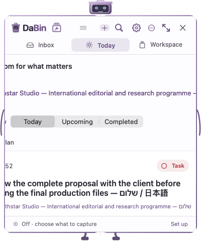
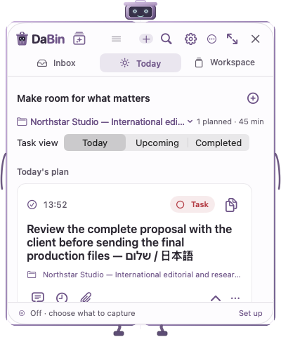

# Readability and usability QA — 30 September 2026

**DaBin 0.4.2 (53): 50/50 native QA suites pass; built, installed and relaunched locally.**

This is an engineering and expert UX review using fictional fixtures and actual native interactions, not feedback from recruited users or accessibility certification. The installed app was used only for quit/relaunch and read-only search/navigation checks. Its existing Auto Capture pause remained in place.

## Issues corrected

| Finding | Correction and evidence |
| --- | --- |
| Long project names could push the entire narrow Today layout outside its window. | Constrained the picker, preserved the task count, and retained full names in tooltips/accessibility. Tested 380×430 and 760×680 layouts. |
| Small card/project metadata was difficult to read. | Workspace body text is 13 pt, important project/date metadata 11 pt; dates and scratchpad save status retain their width. |
| Some theme accents lost contrast on selected backgrounds. | Resolve the rendered accent against selection/focus tint. The 28 measured color/appearance combinations now reach at least 4.60:1 on the conservative surface. Stored theme choices stay intact. |
| Return in Search reset deliberate filters. | Submission now preserves query, date, project, app, type and scroll context. Verified with native tests and real typing. |
| Day/week search was difficult to reach from the compact Weekly header. | Search opens Day / Week / All Captures choices. Escape dismisses it, ⌘7 chooses the week, and the field announces its actual date range. |
| Empty scoped results offered no easy recovery. | Added separate actions to clear content/project/app filters or search all dates while retaining the query. |
| Weekly day export could use a stale offscreen selected date. | Day export now uses the weekly action day and labels that date in the menu. |
| Inbox task/note creation could inherit a previously visited project. | New drafts capture their visible destination. Dirty drafts retain it across navigation/restart and replace-all editing; composer footers disclose it. Legacy draft files still recover. |
| Switching projects restored selection but could leave it offscreen. | Restore the selected visible card on project/mode navigation, otherwise the top. New clipboard items preserve the current visible cards instead of forcing restoration. |
| Oversized checklist input could fail without clear feedback. | Explain the 500-character limit and disable Add; correcting the text enables saving. Native field-editor regression verifies 501 → 500 characters. |
| Transparent backgrounds could make navigation hard to read. | Header/footer stay solid; Increase Contrast and Reduce Transparency request a solid body. Settings provides “Use solid background.” |

## UX choices evaluated

- **Project names:** allowing overflow failed the baseline render; wrapping would enlarge a compact toolbar. A constrained single-line picker with complete accessible names/tooltips keeps the count and actions visible.
- **Search:** a universal icon remains one action outside Weekly. In Weekly, an anchored scope choice makes Day/Week explicit in two clicks; ⌘K remains the direct universal command. Recovery controls distinguish changing content filters from widening the date range.
- **Project restoration:** restoring after every store update would interrupt clipboard browsing. Restoration is keyed only to project/mode navigation. Native tests confirmed three visible cards remained at the exact same screen positions when a new row arrived, although AppKit adjusted its raw scroll offset by one row.

## Before and after

Baseline build 52, narrow Today with a long project name:

Build 53, same content size and fictional project:

[Dark minimum layout](after-today-long-dark.png) · [Expanded clipboard](after-clipboard-expanded.png) · [Minimum Workspace](after-workspace-minimum.png) · [Note destination](after-note-destination.png) · [Scratchpad](after-scratchpad.png) · [Live scoped search](live-search-project.png) · [Live empty-week recovery](live-search-empty-week.png)

The fixture produced **66 native renders per build**: 11 views, two appearances, and 380×430 / 380×680 / 760×680 content sizes. The existing robot frame adds 20×50 points. Representative images were inspected for clipping, hierarchy, long names, mixed-language text and controls. These images contain fictional content only; the production screenshot privacy protection was preserved. [Visual provenance](visual-evidence.json), [baseline module receipt](baseline-fixture-build.json), [final module receipt](final-fixture-build.json).

## Verification

- `./scripts/test.sh --configuration Release`: **50/50**, zero failed suites, no source changes during execution. [Complete source-fingerprinted report](full-qa-report.json).
- Relevant native checks: HeaderInteraction **170**, WorkspaceWindow **162**, Window **243** across two connected screens, ThemeSettings **621**, ProductFoundation **65**, connected end-to-end scenarios **19**. The full run also covers capture inputs, OCR/search, tasks, recurring work, backups/recovery, exports, reminders, robot animations, privacy controls and updater behavior.
- `./scripts/build.sh`: optimized ARM64 Release passes with Swift warnings treated as errors. The project uses compiler/build checks rather than a separate configured Swift lint tool. [Build receipt](build-receipt.json).
- `python3 scripts/generate_project.py --check`, `python3 scripts/app_store_preflight.py --static-only` (**26 checks**) and `git diff --check` pass. [Packaging output](static-preflight.log). This is not distribution approval.
- Final local storage benchmark: one scoped update among 1,000 records **2.6 ms**; one text-preview update **3.4 ms**. These are scoped measurements, not new claims about cold startup or global search latency. [Raw benchmark](QAStorageScopedSaveTests.log).
- Real QA-app keyboard/mouse checks: Search icon → immediate typing; project selection → Return preserves it; Weekly Search → Escape closes; ⌘7 opens the displayed week; zero-results recovery widens dates without losing the query.
- Standalone CLI tests could not acquire foreground search focus on this Mac. That limitation is explicitly logged; immediate typing/Return/clear/Back were verified again in the **installed build 53** using native computer interaction.
- Guarded installation backed up build 52, did not modify the archive, and relaunched the new executable. Version/build, all build and QA input hashes, installed executable SHA-256 and strict code signature match. One installed DaBin process remained running on Inbox; the isolated QA process was closed. [Installation verification](installed-verification.json).

The first full run was 48/50. Follow-up diagnostics corrected test assumptions about the compact drag surface, inherited DisclosureGroup accessibility identifiers, AppKit text binding notifications and native scroll anchoring. Final regressions still exercise the actual mounted controls and visible card positions; the 50/50 result above supersedes those diagnostic runs.

## Changed areas

- Navigation/search: `BoardView.swift`, `SearchScreen.swift`, `WeeklyScopeActions.swift`, `AppState.swift`.
- Draft destinations: `DraftArchive.swift`, `InboxScreen.swift`, `NewNoteScreen.swift`, `TaskEditorScreen.swift`.
- Readability/context: `ThemeSettings.swift`, `SettingsScreen.swift`, `TodayPlanningScreen.swift`, `TaskPlanningEditor.swift`, `WorkspaceItemCard.swift`, `LibraryScreen.swift`, `ScratchpadView.swift`.
- Regression suites: HeaderInteraction, WorkspaceWindow, Window, ThemeSettings, ProductFoundation, WorkInbox and UpdateConfiguration; app build metadata and current-version documentation.

## Limits

User-selected low opacity cannot guarantee body-text contrast over every desktop image; solid cards and navigation are stable, and Settings offers an immediate solid-background reset. See the [contrast audit](CONTRAST-AUDIT.md) for measured limits. VoiceOver speech, physical monitor hot-unplug, every display scaling configuration and macOS 14 hardware were not manually verified. No new public GitHub release, TestFlight upload, notarization or App Store acceptance is claimed by this local QA cycle.
