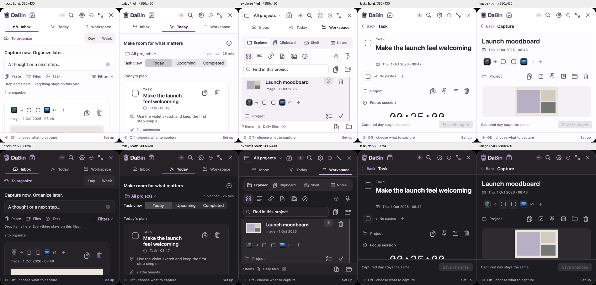
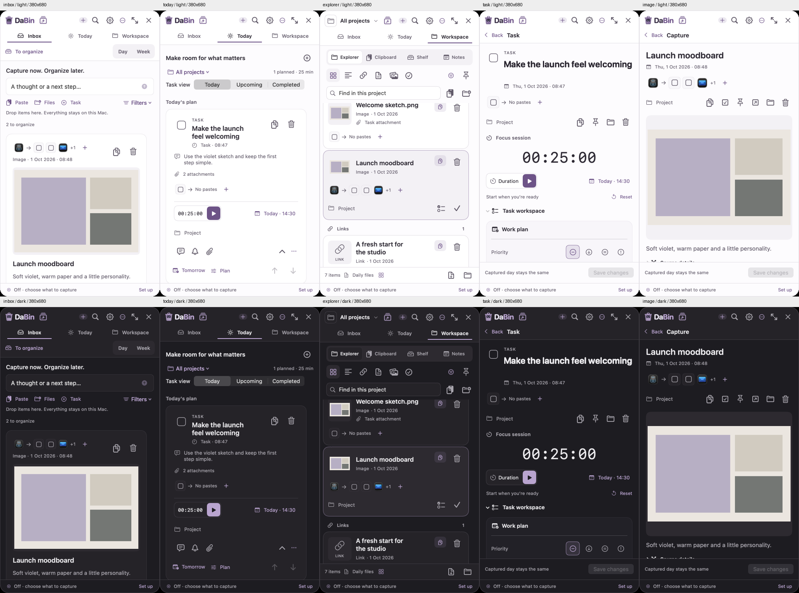
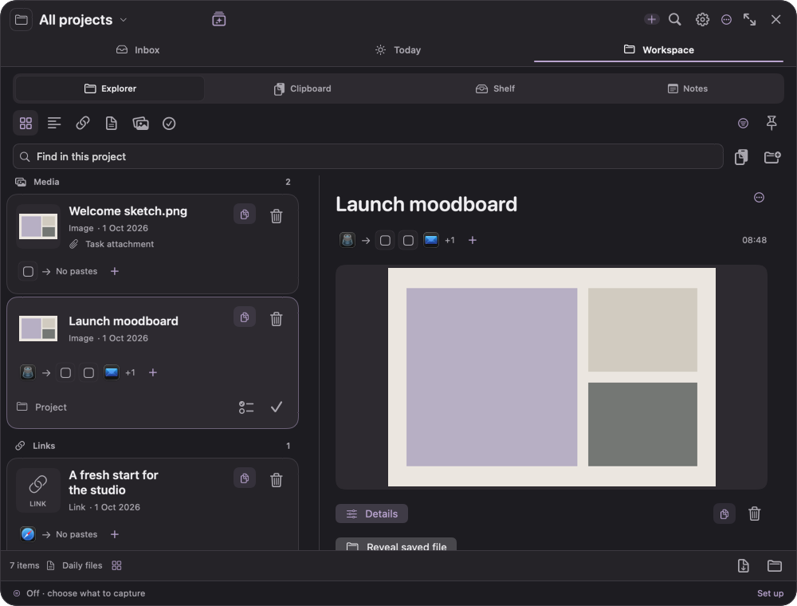

# DaBin release review - 1 October 2026

## Result

**0.4.6 (61) is installed and running locally.** The complete final native Release QA run passes **59/59 suites** on unchanged inputs. All **25 offline public-distribution tests** pass. Optimized standalone ARM64 and unsigned Xcode Release builds pass, as do deterministic project generation, the 26 Store source packaging checks and whitespace validation. All **109 shared build/QA input hashes match**.

The public testing installer and update have **not been published**. Current public GitHub assets remain **0.3.18**. The missing Apple notarization credentials are a real release gate; the available Developer ID certificate alone does not make a downloaded package installable.

## Issues found and corrected

| Finding | Fix | Regression coverage |
| --- | --- | --- |
| Capture feedback stayed at the old robot position after relocation | Relocation completion relays out the receipt badge with the new native character frame | RobotDrop: 117 checks, including real relocated success/error feedback |
| Crash recovery could re-enable a completed or pre-snooze reminder when a comment was saved | Optional committed reminder revision reconciles recovered editor fields against saved metadata; legacy drafts retain their edits | WorkInbox: 44 checks, including completion, snooze, legacy recovery and pending countdown edits |
| Explicitly shelved task attachments disappeared and ZIP export used different project ownership | Shared shelf membership includes attached resources and inherits the parent task project; unsupported refile/reattach actions are hidden | Workspace: 48 checks, including scoped/unfiled search, export, removal and trash |
| Public packaging did not bind the embedded updater executable to the build receipt | Receipt records its SHA-256; pre-sign packaging rejects missing/mismatched helper bytes; post-sign hashes remain separate | 25 offline distribution tests, including four added refusal/binding regressions |
| Resize test expected a fractional native window origin | Fixture aligns with AppKit's whole-point placement; exact dimensions and opposite-edge assertions are retained | WindowResizeInteraction: 32 checks |
| Guide and privacy wording described earlier navigation/retention behavior | Updated one-page guide; privacy explains recoverable optional retention, current Day grouping and limits of screenshot-overlay exclusion | PDF structure/layout checks and native privacy/resource packaging verification |

## Included pending work

The commit also includes previously reviewed Inbox Day / Week routing and Quiet Orbit artwork/geometry. Those changes preserve date/filter/draft context, empty-week hiding, native copy/drop, source trails, window movement/resizing, task conversion, Explorer and local storage. Their detailed evidence remains in [Inbox calendar](../inbox-calendar-2026-10-01/README.md) and [Quiet Orbit](../quiet-orbit-2026-10-01/README.md).

## Files changed

- UI/state: `AppState.swift`, `DraftArchive.swift`, `BoardView.swift`, `InboxScreen.swift`, `LibraryScreen.swift`, `WorkspaceQuery.swift`, `WorkspaceItemCard.swift`, `SettingsScreen.swift`.
- Robot: `QuietOrbitGeometry.swift`, `CornerController.swift`, `RobotView.swift`, `RobotCharacterView.swift`, `RobotPlacementSettings.swift`, `AutoCaptureRobotPresenter.swift`, `AutoCaptureRobotCelebration.swift`, and the supplied `native/Design/QuietOrbit` references.
- Regression/build: native motion, grouping, window, header, drop, draft and shelf tests; `build_app.py`, `package_notarized_distribution.py`, `test_notarized_distribution.py`, `run_qa.py`, Info.plist and the generated Xcode project.
- Documentation: candidate release notes, changelog, root/documentation indexes, PDF guide/generator, privacy text and QA evidence.

The app retains its native SwiftUI/AppKit/Core Animation architecture. No new animation dependency, cloud capture storage or permissions were introduced.

## Verification

- [Final full QA report](full-qa-report.json): 59/59, `sourceChangedDuringRun=false`, full registered coverage. Earlier resize-fixture and resource-documentation runs were followed by this final unchanged-input run; they are not presented as the final result.
- [Release build receipt](build-receipt.json): ARM64, 0.4.6 (61), main/updater executable SHA-256 and source inventory.
- [Distribution Python results](distribution-python-tests.log): 25 passing offline tests, no Apple submission.
- [Store source preflight](app-store-static-review.log): 26 checks, no Store signing or approval claim.
- [Verification summary](verification-summary.json) and [local installation proof](installation.json).
- [Visual manifest](visual-renders.json): 40 isolated native renders across 380 x 430, 380 x 680, 1000 x 760 and the wide layout, in light/dark themes. Compact sets and representative expanded Explorer/task views were inspected for clipping, preview space, readable controls and scroll access. These are production-view snapshots with fictional fixtures, not feedback from real users.
- [PDF layout check](guide-layout-check.json): one A4 landscape page, 532 words, required current features and identical output/repository PDF copies. The final Poppler render was visually inspected.

## Local installation and data

A private pre-update archive/preferences backup was verified before replacement. The guarded installer retained the previous app for rollback. The final installed main binary, updater binary and bundled privacy text match the Release receipt/source. Read-only post-relaunch checks preserve **all 40 capture payloads and all 16 original attachment hashes**. No capture contents or private archive manifest were copied into this report.

Live native UI checks verified Inbox → Week → Day, the direct Settings page, **Get updates**, **0.4.6 (61)** and the retained **Around camera island** preference. The updated process runs from `~/Applications/DaBin.app`.

## Publication gate and remaining limitations

- Exact Developer ID Application identity for team 8QG4967CSU is installed. Its signing attempt did not complete and was cancelled without replacing the previous build.
- The narrowly checked `DaBin-notary` profile named in the release instructions returned "No Keychain password item found". No credentials were displayed. Automatic approval review rejected broad keychain discovery because it could probe unrelated credentials; it was not bypassed.
- A user must complete secure Apple notarization authentication on this Mac (or provide the already-configured profile name). Passwords and private keys must stay out of chat, the repository and command history.
- Then run [the public release process](../../RELEASING.md): signed/notarized/stapled packages, quarantined Gatekeeper/system-policy verification, exact ZIP fresh-install/replacement checks, migration from the old ad-hoc install, staging, publication and anonymous download/hash checks. No unsigned fallback is a public testing installer.
- One actual display was attached. Native resizing/movement passed there; multi-display geometry has synthetic coverage, but an actual cross-display gesture and unplug scenario could not be repeated in this session.
- TestFlight/App Store upload, Apple approval and notarized distribution are not claimed by local or unsigned Xcode QA.

The permanent fresh-install and updater URLs already exist in the repository and staging workflow. They will contain this candidate only after the verified release is published; their current older contents are explicitly identified in the README.
