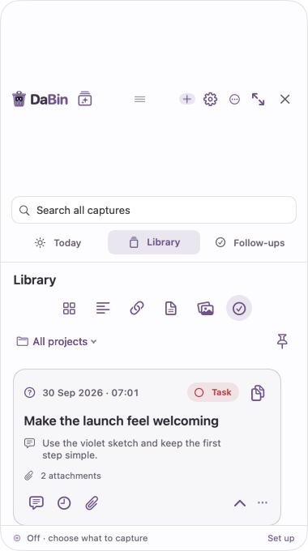
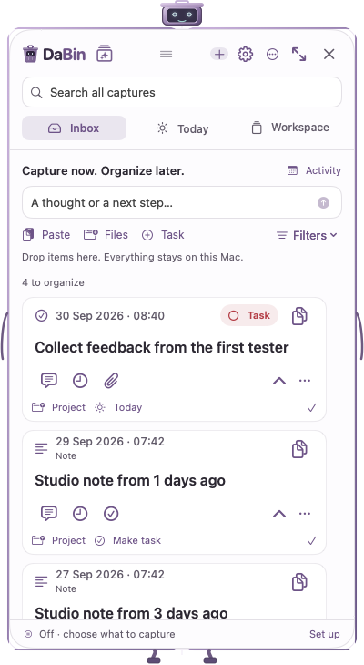
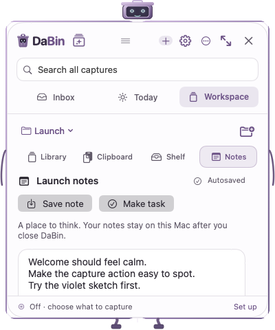
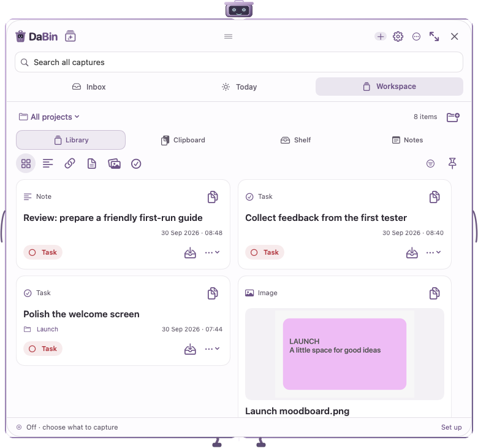

# DaBin product review and working candidate

**Installed and running locally:** 0.4.2 (51), native macOS 14+ / Apple silicon. This is a local product review and implementation, not an App Store approval or a recruited-user study.

## What changed

The main problem was competing meanings of “Today,” an oversized header, and navigation that lost context. Capture, archive browsing and unfinished work now have three visible destinations:

- **Inbox:** paste, import, drop, or write a quick note; turn feedback into a task and file it later.
- **Today:** choose a workday independently of a deadline or reminder. Set priority and effort, reorder, reschedule, complete, repeat, and add checklist steps.
- **Workspace:** switch clients/projects while keeping files, links, clipboard history, named snippets, a collection shelf and autosaving notes together.

Activity retains the existing daily/weekly receipt history. Search remains visible and searches captures, local OCR/PDF text, task steps, snippet names and saved project notes. Returning from search restores the previous work, including unfinished task edits. Compact and expanded presentation use the same state.

## Issues found and corrected

| Finding | Correction |
|---|---|
| The drag handle expanded vertically, consuming most of a small window | Fixed header height, visible drag grip, compact labels and controls |
| Search reset a selected content filter and could strand a task | Search context snapshots, restored filters/drafts and regressions for nested navigation |
| Expanded geometry could replace the normal saved position | Separate restore frame; native drag, resize, expansion and reopen checks |
| Occlusion could blank the application surface | Separate content visibility from animation activity; occluded task celebrations stop |
| Notes required an Add-menu detour | Inline Inbox composer; Return saves a note |
| The smallest Workspace hid its shelf content and note actions | Condensed controls; Shelf toolbar scrolls with items; note actions precede the editor |
| Unsaved edits vanished on quit | Private recoverable composer/detail drafts; explicit persistence error feedback |
| Task deadlines, reminders and intended workdays were conflated | Separate planning fields with recurrence lineage and atomic persistence |
| Large imports repeatedly scanned pending Core Data objects | Batched metadata lookup; rollback and duplicate-ID coverage |
| First-open maintenance could delay showing saved work | Metadata-first opening; small cancellable archive/preview maintenance batches |
| New workspace notes were outside the archive backup | Verified additive workspace backup/restore with authored-text conflict handling |
| A real sandboxed ZIP export failed despite unit tests passing | Use Foundation’s permitted replacement directory; native Save Panel export and exact ZIP contents reverified |
| Clipboard cleanup could erase useful organized material | Default Never; explicit confirmation; recoverable deletion; protection for tasks, projects, pins, snippets, shelf and filed Inbox items |

## Alternatives evaluated

See [alternatives](alternatives.md). The review compared a labeled Inbox/Today/Workspace model, a single activity feed with a view menu, and a separate tiny capture bar plus workspace. The first was implemented and exercised in native views. The latter two were assessed through the existing baseline and design analysis; they were not three independently user-tested prototypes.

The robot remains the minimal capture entry point. A second tiny capture window would duplicate that role and add focus/context transitions. Optional focus timing, time records, calendar sync, utilities and AI are ordered in the [roadmap](ROADMAP.md), with reasons for deferral. Existing local OCR was retained and tested.

## Before and after

Baseline native view, showing the excessive header area:

Current compact Inbox:

Current minimum-size project notes and expanded library:

These are production-view native renders using fictional data. The [final render manifest](latest/final-render-verification.json) records all 36 images, dimensions and hashes from the final compiled module. [Baseline evidence and observed interaction counts](README.md) and [the minimum-size before-fix evidence](latest/before-compact-fix/native-scratchpad-light-380-minimum.png) preserve the comparison. Actual native interactions and a live screenshot are documented separately in [live evidence](latest/RESULTS.md). The installed app's screenshot-exclusion behavior remains enabled.

## Verification

**Full regression:** 50/50 optimized ARM64 suites passed on an unchanged source snapshot in `native/build/qa/runs/20260930T060657731157Z/report.json`. A subsequent sandbox-only export failure was fixed in `ShelfExport.swift`, the only production file changed after that run. All three affected suites passed on final sources: ConnectedWorkflow (19 checks), Workspace (39), and native WorkspaceWindow (130). The final optimized ARM64 app builds successfully with warnings treated as errors, and its installed executable exactly matches the build receipt. [Full run](latest/full-regression-report.json) · [Final affected suites](latest/final-export-regression-report.json) · [Build receipt](latest/final-build-receipt.json). Earlier failed iterations remain recorded and are not counted as passing verification.

Deterministic Xcode project validation, `git diff --check`, and all 26 App Store source-packaging checks passed. Those packaging checks do not establish distribution signing or Apple acceptance.

The connected-workflow suite exercises client feedback → project → task → managed attachment, multi-client shelf collections, finding/copying a snippet while retaining a dirty task, per-client selection, today's order/completion/rescheduling, recurrence, restart and portable backup restore. Existing suites cover input, OCR/PDF extraction, export, previews, notification failure paths, auto capture, cancellation, privacy, window movement and robot motion.

The real sandbox export probe initially failed with Cocoa error 513 when it tried to create an unselected sibling directory. It now uses [Foundation’s replacement directory](https://developer.apple.com/documentation/foundation/filemanager/searchpathdirectory/itemreplacementdirectory). A real Save Panel grant produced a valid 446-byte ZIP containing all 79 synthetic UTF-8 bytes exactly. [Probe evidence](latest/sandbox-export/result.json).

The live synthetic app verified quick-note saving, capture-to-task conversion, Today planning, exact scratchpad recovery after restart, Media-filter restoration after search, and hide/reopen context. No fictional captures were added to the personal archive.

## Local installation and existing data

The installed application reports **DaBin 0.4.2 (51)** in Settings, with Get updates present. The prior app and both local archives were backed up before launch. All 19 existing readable capture records retained their pre-existing fields apart from schema version; all seven referenced originals remained byte-identical. The unfinished task and its 30-minute countdown were preserved as a draft, verified in the new editor, and flushed on normal quit. No reminder was started by the review.

Live installed checks passed for Settings, draft recovery, expand/restore, hide/reopen with context, clean quit and restart. The new Inbox is open at completion. Auto Capture remains paused and website previews remain off. [Installation verification](latest/installed-verification.json). The production screenshot exclusion returns a blank screenshot in the automation tool, so visual comparisons use the isolated native render fixture.

## Performance observations

| Measurement | Baseline | Current |
|---|---:|---:|
| One metadata batch of 10,000 generated records | 319.6 seconds | 0.719 seconds |
| Search median, 12 queries over 10,000 text records | 127.2 ms | 125.4 ms |
| Metadata-ready load with readable-folder repair deferred | Not isolated | 1.139 seconds |
| Visible synthetic app idle, four samples over 9 seconds | 0.0% CPU, 136.8 MiB RSS | 0.0% CPU, 143.6 MiB RSS |

The actual installed app, with Inbox visible and the existing archive, showed **0.4–0.6% CPU and approximately 103 MiB RSS** over four samples in nine seconds. Its cumulative CPU time increased by 0.07 seconds. This is separate from the synthetic wrapper comparison above. [Installed process samples](latest/installed-idle-samples.json).

The review wrapper's setup-to-first-layout measured 551–1,407 ms across two launches; reopening measured 108 ms. These exclude process bootstrap, GPU presentation and production robot choreography. Full first-time readable-folder generation remained expensive; it now runs as deferred maintenance. These are local observations, not cross-device performance guarantees. [Raw measurements and scope](latest/RESULTS.md).

## Main implementation files

- Navigation and lifecycle: `AppState.swift`, `ApplicationCoordinator.swift`, `AppDelegate.swift`, `CornerController.swift`, `WindowDragHandle.swift`, `BoardResizeGeometry.swift`.
- Views: `BoardView.swift`, `InboxScreen.swift`, `TodayPlanningScreen.swift`, `LibraryScreen.swift`, `WorkspaceItemCard.swift`, `ScratchpadView.swift`, `SearchScreen.swift`, task/detail/settings views.
- Persistence: `TaskPlanning.swift`, `CaptureStore.swift`, `CaptureRepository.swift`, `Domain.swift`, `DraftArchive.swift`, `WorkspaceStore.swift`, `ArchiveBackup.swift`.
- Clipboard and collections: `WorkspaceQuery.swift`, `WorkspaceClipboard.swift`, `ShelfCaptureController.swift`, `ShelfExport.swift`, clipboard retention service/settings.
- Targeted regressions include connected workflows, foundation navigation/drafts, workspace behavior/native layout, task planning, backup, retention, repository batching and deferred maintenance, alongside the existing full native suite.

## Limits and next validation

- No recruited-user sessions were conducted. A short freelancer pilot should validate terminology, Inbox triage, project switching and interruption recovery in real work.
- Native tests exercise both attached displays. Physical unplug/replug, separate Spaces/fullscreen combinations and other display scaling configurations still need hands-on validation.
- Accessible names, focus targets, keyboard dispatch and native actions are tested. A complete VoiceOver session has not been run.
- Notification scheduling and denial/failure paths are tested with isolated clients. This review does not establish real notification delivery through every macOS Focus state.
- Live website-preview networking stayed off. Core search/OCR and file workflows are local. Reuse offers Copy and Copy as plain text followed by normal paste in the working app; no Accessibility permission or injected cross-app keystroke was added.
- Intel and macOS 14–25 runtime coverage is not established on this macOS 26.6.2 Apple-silicon environment.
- Public distribution signing, notarization, TestFlight upload and App Store acceptance are separate release gates. The review concluded with a local installation; the subsequent approved source push does not publish a new installer or TestFlight build.
